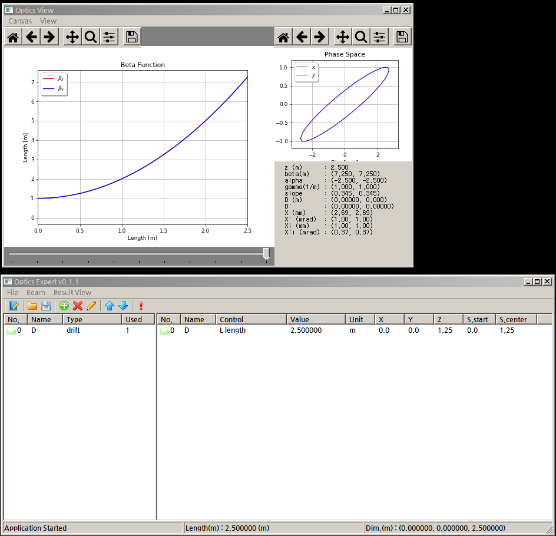
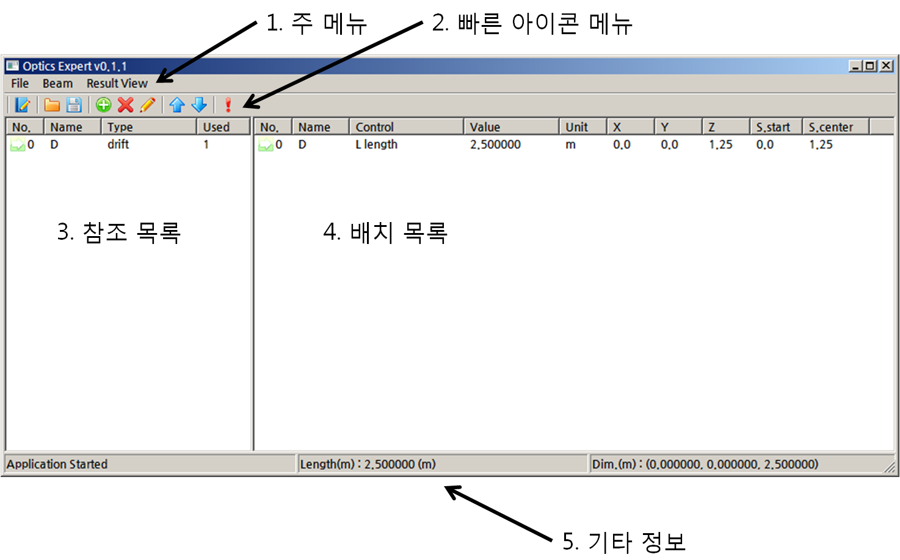
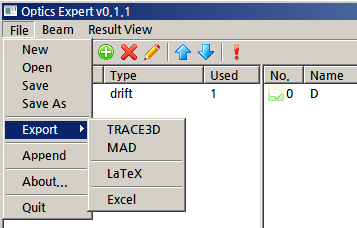
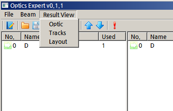
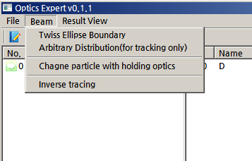
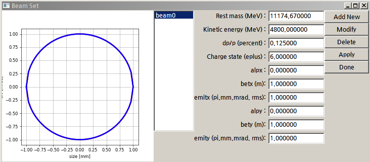

Optics Expert 사용자 메뉴얼
===========================

소개
----

OpticsExpert는 python으로 만든 빔 광학 계산 프로그램이다. 오래전에 만들어진 빔 광학 프로그램들의 단점(Text User Interface)을 개선하여 편의성을 증가시키는것이 이 프로그램을 만든 이유이다. 이 프로그램은 GPL 3.0 라이선스를 따른다. 따라서 교육용, 상업용을 포함한 모든 목적의 사용이 가능하다.

OpticsExpert는 GitHub에서 관리와 업데이트가 공식적으로 이루어진다. 주소는 다음과 같다. http://github.com/garamhahn/OpticsExpert

이 문서는 프로그램의 설치, 이용 방법, 원리를 모두 다룬다. 설치는 설치 섹션에, 원리는 부록에, 이용 방법은 나머지 섹션에 설명하였다.

이 프로그램은 2017년 대한민국 교육부(이공학개인기초연구과제, NRF-2017R1D1A1B03036184)의 지원을 받아 제작되었다.

설치
----

### Python

OpticsExpert를 실행하려면 python이 PC에 설치되어 있어야 합니다. 개발과 테스트는 python 2.x 버전에서 이루어졌습니다. python 3.x 이용자분들께서는 version 2.x로 다운그레이드 해서 이용하시거나 가상 환경에서 이용하시는 것을 추천합니다. Python의 공식 홈페이지는 다음과 같습니다. (http://python.org\)

파이선의 설치는 다음의 문서를 참고한다. http://docs.python-guide.org/en/latest/starting/installation/

### 필수 라이브러리들

OpticsExpert는 다음의 세 가지 라이브러리들을 사용한다. 1. matplotlib - 플롯을 그리고 업데이트 하기 위해 1. scipy - 다변수 해석 등의 수치해석 알고리즘을 이용하기 위해 1. wxpython - 창, 버튼, 멀티프로세싱 등을 사용하기 위해

따라서 python의 설치 이후, `pip`을 이용하여 아래와 같은 명령으로 필수 라이브러리들을 설치한다. 나머지 의존성은 `pip`이 모두 알아서 설치할 것이다.

```
$ pip install -U matplotlib scipy wxpython
```

올바로 설치가 되었는지 확인하기 위해 다음과 같은 명령을 사용할 수 있다. `pip list` 옵션은 현재 설치되어있는 라이브러리를 모두 보여준다.

```
$ pip list
.
.
matplotlib (2.1.1) ............ [확인]
..
numpy (1.13.3)     ............ [확인]
.
<중간중간생략>
.
scipy (1.0.0)      ............ [확인]
.
.
wxPython (4.0.0b2) ............ [확인]
.
Garam@NEBUCHADNEZZAR C:\Users\Garam
$
```

그 밖의 `pip`의 사용법은 다음의 문서를 참고한다. https://pip.pypa.io/en/stable/user_guide/

### 소스코드 복사

OpticsExpert는 github를 이용하여 개발/관리된다. 따라서 최신 버전의 소스코드를 얻기 위해서는 다음과 같이 실행한다.\` $ git clone http://github.com/garamhahn/OpticsExpert 위 명령 정상적으로 종료되면, OpticsExpert 소스코드가 동일한 이름의 디렉토리 안asdf에 복사 되어있을 것이다.

둘러보기
--------

설치 섹션의 두 단계 (1) 파이선 설치, (2) 필수 라이브러리 설치, (3) OpticsExpert 다운로드가 잘 되었다면, 이제 코드를 실행할 준비가 되었다. 코드는 OpticsExpert가 복사된 디렉토리에서 아래와 같이 실행한다.

```
$ python OpticsExpert.py
```



### 메인 윈도우

 메인 윈도우는 위 그림과 같이 (1) 주 메뉴, (2) 빠른 아이콘 메뉴, (3) 참조목록, (4) 배치목록, (5) 기타 정보 영역으로 나뉜다. 주 메뉴는 파일 관련한 부분, 빔과 관련된 부분, 그리고 계산 결과와 관련된 부분으로 나뉜다. 자세한 내용은 메뉴 섹션에서 다시 설명한다. 빠른 아이콘 메뉴는 주 메뉴에서 자주 사용하는 기능을 따로 분리하여 아이콘화 한 것이다. 이를 이용하면, 매번 메뉴를 사용하는 것 보다 빠르고 편리하게 작업할 수 있다.

(3) 참조 목록은 빔 라인에 실제 배치할 요소들이다. 이곳에 전자석, 드리프트 챔버 등을 등록하면, (4) 배치목록에 배치가 가능하다. 참조 목록에 많이 등록해 놓아도, 실제 배치목록에 없으면 계산되지 않는다.

#### 메뉴 설명

##### File



`New`는 새로운 빔광학 파일을 만든다. 현재 만들던 계산은 사라지고 전체를 초기화한다.

`Open`은 기존에 `Save` 혹은 `Save As`로 저장했던 빔광학 파일 '.opt' 을 읽어 로딩한다.

`Save`는 현재 내용을 현재 파일에 저장한다.

`Save As`는 현재의 계산 내용을 새로운 파일에 저장한다.

`Export`는 다른 형태의 파일로 저장할 때 사용한다. 계산을 검증하는 용도나, 복잡한 리포트를 간편하게 작성하기 위해 이용하면 좋다. 아래의 포멧을 지원한다.* `TRACE3D`는 Los Alamos National Laboratory 의 유명한 선형 빔 광학 소프트웨어이다.* `Mad`는 CERN의 유명한 빔 광학 소프트웨어이다.* `LaTeX`은 현재 계산된 주요 내용을 조판 프로그램 Latex 포멧으로 저장하여 리포트를 작성해준다.* `Excel`은 HWP나 Ms-Word와 같은 프로그램을 이용하여 리포트를 작성하는 경우에 이용하기 위해 옵틱스 테이블을 모두 엑셀로 변환한다.

##### Beam



`Tiwss Ellipse Boundary`는 입력 빔을 정의하는데 사용된다. 단수, 혹은 복수의 입력빔을 동시에 정의할 수 있으며, 정의하는 빔의 Transverse ellipse 를 모두 볼 수 있다.

`Arbitrary Distribution`은 트랙킹 전용 옵션이다. 콜리메이터를 지나 컷팅된 빔 같은 특수한 빔 분포를 정의하고 싶을 때 사용된다.

`Change Particle with holding optics`는 Optics function을 고정한 채로 입자를 교체하는 기능을 지원한다. 이 기능은 동일한 envelope을 만드는 전자석들의 세기를 계산하여 바꾸는 일을 한다.

`Inverse tracing` 역추적 기능은 envelope function을 고정시킨 상태로 빔 라인의 순서를 정 반대로 뒤집어 놓는다. Fitting function이 정상 동작하지 않거나, 결과 빔으로 부터 시작빔을 거꾸로 계산하고 싶을때 사용할 수 있다.

##### Result View



`Optic` 광학 envelope 결과 창을 켜거나 끈다.

`Tracks` 광학적 트래킹 계산을 진행하고 결과를 보여준다.

#### 빠른 아이콘 메뉴


왼쪽에서 오른쪽 순서대로 `New`, `Save`, `Save As`, `Add Ref. item`, `Remove Ref. item`, `Modify Ref. item`, `Move selected item up`, `Move selected item down`, `Fitting` 이다.

-	`New`는 `File` 메뉴의 `New` 이다.
-	`Save`는 `File` 메뉴의 `Save` 이다.
-	`Save As`는 `File` 메뉴의 `Save As` 이다.

-	`Add Ref. item`는 참조 리스트에 장치를 추가하고 싶을때 사용한다.

-	`Remove Ref. item`는 참조 리스트에 장치를 제거하고 싶을때 사용한다. (배치된 장치가 없어야 제거된다.)

-	`Modify Ref. item`는 참조 리스트에 있는 장치를 변경하고 싶을때 사용한다. 변경된 내용은 즉시 배치된 장치들에 반영된다.

-	`Move selected item up`는 배치된 장치의 순서를 하나 위로 올리고 싶을 때 사용한다.

-	`Move selected item down`는 배치된 장치의 순서를 하나 내리고 싶을 때 사용한다.

-	`Fitting`은 특정 위치의 빔을 컴퓨터가 알아서 맞춰주게끔 하고플 때 사용한다.

빔라인 디자인
-------------

계산 순서는 다음을 따른다.

### 빔 정의



### Ref. Item의 등록과 사용

### 아이템 배치하기

### 조절하는 방법

### Fitting

### 트랙킹 해보기

기타 기능들
-----------

부록
----
