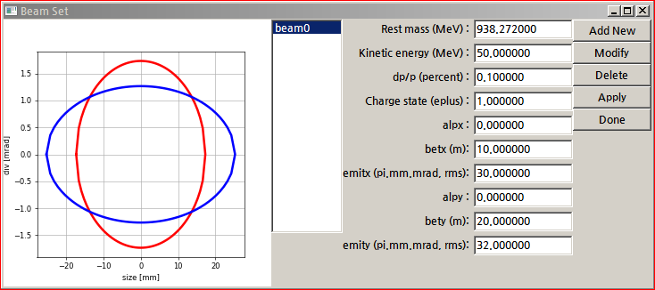
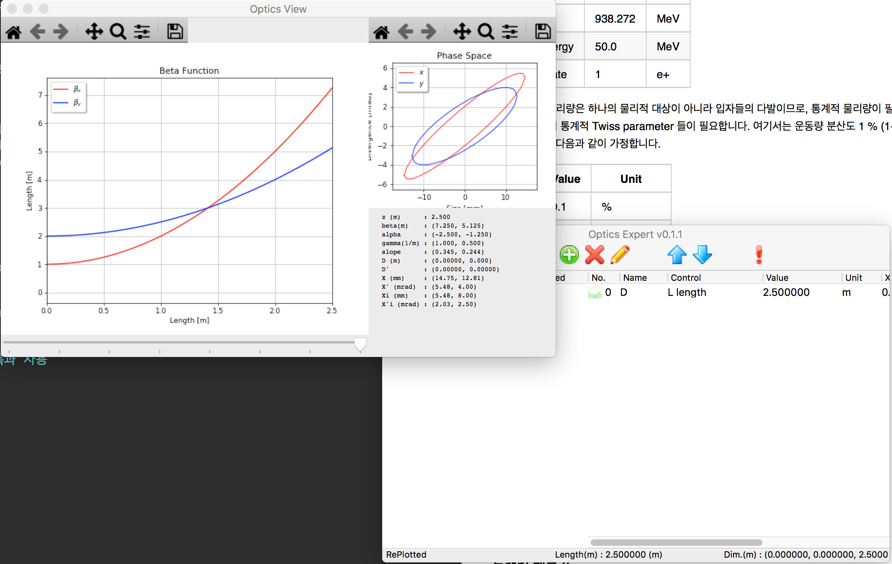
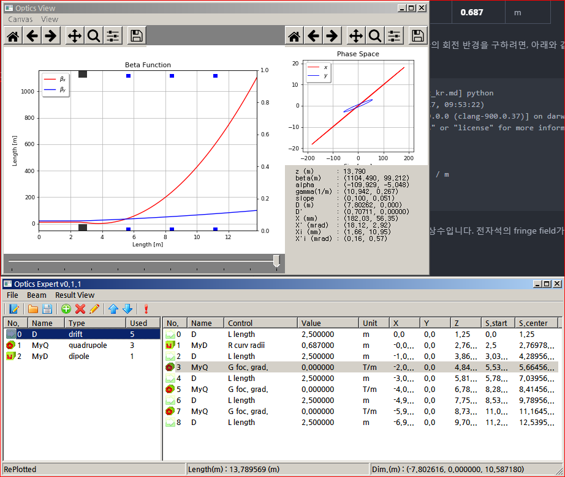
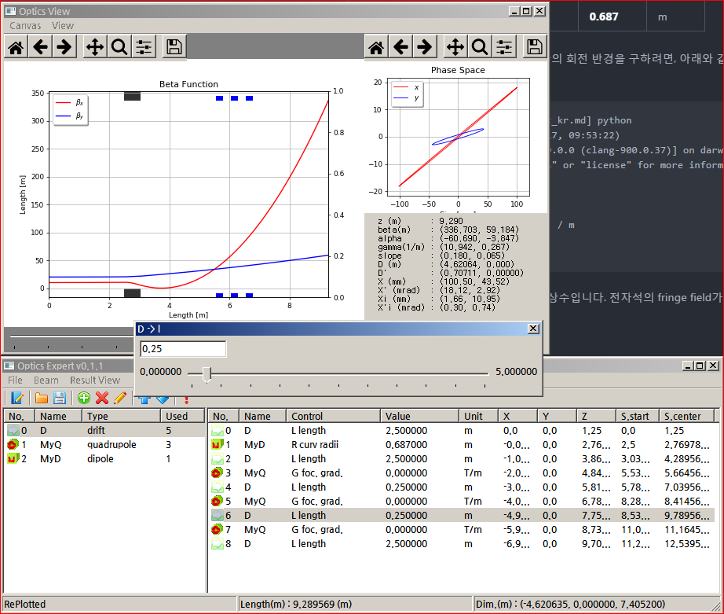
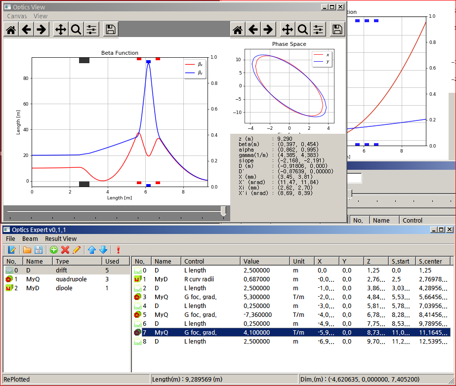

Optics Expert 사용자 메뉴얼
===========================

소개
----

OpticsExpert는 python으로 만든 빔 광학 계산 프로그램입니다. 오래전에 만들어진 빔 광학 프로그램들의 단점(Text User Interface)을 개선하여 편의성을 증가시키는것이 이 프로그램을 만든 이유입니다. 이 프로그램은 GPL 3.0 라이선스를 따릅니다. 따라서 교육용, 상업용을 포함한 모든 목적의 사용이 가능합니다.

OpticsExpert는 GitHub에서 관리와 업데이트가 공식적으로 이루어지고, 주소는 다음과 같습니다. http://github.com/garamhahn/OpticsExpert

이 문서는 프로그램의 설치, 이용 방법, 원리를 모두 다룹니다. 설치는 [설치](#설치) 섹션에, 원리는 부록에, 이용 방법은 나머지 섹션에 설명하였습니다.

이 프로그램은 2017년 대한민국 교육부(이공학개인기초연구과제, NRF-2017R1D1A1B03036184)의 지원을 받아 제작되었습니다.

설치
----

### Python

OpticsExpert를 실행하려면 python이 PC에 설치되어 있어야 합니다. 개발과 테스트는 python 2.x 버전에서 이루어졌습니다. python 3.x 이용자분들께서는 version 2.x로 다운그레이드 해서 이용하시거나 가상 환경에서 이용하는 것을 추천합니다. Python의 공식 홈페이지는 다음과 같습니다. (http://python.org\)

파이선의 설치는 다음의 문서를 참고할 수 있습니다. http://docs.python-guide.org/en/latest/starting/installation/

### 필수 라이브러리들

OpticsExpert는 다음의 세 가지 라이브러리들을 사용합니다. 1. matplotlib - 플롯을 그리고 업데이트 하기 위해 1. scipy - 다변수 해석 등의 수치해석 알고리즘을 이용하기 위해 1. wxpython - 창, 버튼, 멀티프로세싱 등을 사용하기 위해

따라서 python의 설치 이후, `pip`을 이용하여 아래와 같은 명령으로 필수 라이브러리들을 설치해야 합니다. 필수 라이브러리를 설치하기 위한 또 다른 의존성들은 `pip`이 모두 알아서 설치할 것입니다.

```
$ pip install -U matplotlib scipy wxpython
```

올바로 설치가 되었는지 확인하기 위해 다음과 같은 명령을 사용할 수 있습니다. `pip list` 옵션은 현재 설치되어있는 라이브러리를 모두 보여줍니다.

```
$ pip list
.
.
matplotlib (2.1.1) ............ [확인]
..
numpy (1.13.3)     ............ [확인]
.
<중간중간생략>
.
scipy (1.0.0)      ............ [확인]
.
.
wxPython (4.0.0b2) ............ [확인]
.
Garam@NEBUCHADNEZZAR C:\Users\Garam
$
```

그 밖의 `pip`의 사용법은 다음의 문서를 참고하십시오. https://pip.pypa.io/en/stable/user_guide/

### 소스코드 복사

OpticsExpert는 github를 이용하여 개발/관리됩니다. 따라서 다음과 같이 실행하여 github로 부터 최신 버전의 소스코드를 다운로드 할 수 있습니다.

```
$ git clone http://github.com/garamhahn/OpticsExpert
```

위 명령이 정상적으로 종료되면, OpticsExpert 소스코드가 동일한 이름의 디렉토리 안에 복사 되어있을 것입니다.

둘러보기
--------

설치 섹션의 두 단계 (1) 파이선 설치, (2) 필수 라이브러리 설치, (3) OpticsExpert 다운로드가 잘 되었다면, 이제 코드를 실행할 준비가 되었습니다. 코드는 OpticsExpert가 복사된 디렉토리에서 아래와 같이 실행합니다.

```
$ python OpticsExpert.py
```

실행 후에는 두 개의 창이 나타납니다. 아래 그림과 같은 창이 나타나면 사용할 준비가 된 것입니다.


### 메인 윈도우

 메인 윈도우는 위 그림과 같이 (1) 주 메뉴, (2) 빠른 아이콘 메뉴, (3) 참조목록, (4) 배치목록, (5) 기타 정보 영역으로 나뉩니다. 주 메뉴는 다시 파일과 관련된 부분, 빔과 관련된 부분, 그리고 계산 결과와 관련된 부분으로 나뉩니다. 자세한 내용은 메뉴 섹션에서 다시 설명합니다. 빠른 아이콘 메뉴는 주 메뉴에서 자주 사용하는 기능을 따로 분리하여 아이콘화 한 것입니다. 이를 이용하면, 매번 메뉴를 사용하는 것 보다 빠르고 편리하게 작업할 수 있습니다.

(3) 참조 목록은 빔 라인에 실제 배치할 요소들입니다. 이곳에 전자석, 드리프트 챔버 등을 등록하면, (4) 배치목록에 등록된 요소들을 배치할 수 있습니다. 참조 목록에 많이 등록해 놓아도, 실제 배치목록에 없으면 계산되지 않습니다.

#### 메뉴 설명

##### File


`New`는 새로운 빔광학 파일을 만듭니다. 현재 만들던 계산은 모두 사라지고 프로그램 전체를 초기화시킵니다.

`Open`은 기존에 `Save` 혹은 `Save As`로 저장했던 빔광학 파일 '.opt' 을 읽어들입니다.

`Save`는 현재 내용을 현재 파일에 저장합니다.

`Save As`는 현재의 계산 내용을 새로운 파일에 저장합니다.

`Export`는 다른 형태의 파일로 저장할 때 사용합니다. 계산을 검증하는 용도나, 복잡한 리포트를 간편하게 작성하기 위해 이용하면 좋습니다. 아래의 포멧을 지원합니다.

-	`TRACE3D`는 Los Alamos National Laboratory 에서 개발된 선형 빔 광학 계산 소프트웨어 입니다.
-	`Mad`는 CERN에서 개발된 선형/비선형 빔 광학 계산 소프트웨어 입니다.
-	`LaTeX`은 현재 계산된 주요 내용을 조판 프로그램 Latex 포멧으로 저장하여 리포트를 작성해줍니다.
-	`Excel`은 옵틱스 테이블을 모두 엑셀로 변환합니다. 리포트 작업에 유용합니다.

##### <a name="m-beam"></a>Beam


`Tiwss Ellipse Boundary`는 입력 빔을 정의하는데 사용됩니다. 단수, 혹은 복수의 입력빔을 동시에 정의할 수 있으며, 정의하는 빔의 Transverse ellipse 를 모두 볼 수 있습니다.

`Arbitrary Distribution`은 트랙킹 전용 옵션입니다. 콜리메이터를 지나 컷팅된 빔 같은 특수한 빔 분포를 정의하고 싶을 때 사용됩니다.

`Change Particle with holding optics`는 Optics function을 고정한 채로 입자를 교체하는 기능을 지원합니다. 이 기능은 동일한 envelope을 만드는 전자석들의 세기를 계산하여 바꾸는 일을 합니다.

`Inverse tracing` 역추적 기능은 envelope function을 고정시킨 상태로 빔 라인의 순서를 정 반대로 뒤집어 놓습니다. Fitting function이 정상 동작하지 않거나, 결과 빔으로 부터 시작빔을 거꾸로 계산하고 싶을때 사용할 수 있습니다.

##### Result View


`Optic` 광학 envelope 결과 창을 켜거나 끕니다.

`Tracks` 광학적 트래킹 계산을 진행하고 결과를 보여줍니다.

#### 빠른 아이콘 메뉴


왼쪽에서 오른쪽의 순서로 `New`, `Save`, `Save As`, `Add Ref. item`, `Remove Ref. item`, `Modify Ref. item`, `Move selected item up`, `Move selected item down`, `Fitting` 입니다.

-	`New`는 `File` 메뉴의 `New` 입니다.
-	`Save`는 `File` 메뉴의 `Save` 입니다.
-	`Save As`는 `File` 메뉴의 `Save As` 입니다.

-	`Add Ref. item`는 참조 리스트에 장치를 추가하고 싶을때 사용합니다.

-	`Remove Ref. item`는 참조 리스트에 장치를 제거하고 싶을때 사용합니다. (배치된 장치가 없어야 제거됩니다.)

-	`Modify Ref. item`는 참조 리스트에 있는 장치를 변경하고 싶을때 사용합니다. 변경된 내용은 즉시 배치된 장치들에 반영됩니다.

-	`Move selected item up`는 배치된 장치의 순서를 하나 위로 올리고 싶을 때 사용합니다.

-	`Move selected item down`는 배치된 장치의 순서를 하나 내리고 싶을 때 사용합니다.

-	`Fitting`은 특정 위치의 빔을 컴퓨터가 알아서 맞춰주게끔 하고플 때 사용합니다.

빔라인 디자인의 예
------------------

여기에서는 간단한 빔라인 디자인을 수행하여 프로그램의 사용법을 보여줍니다. 디자인은 (1) 빔 정의, (2) 참조 요소의 등록, (3) 배치, (4) 조절, (5) 핏팅 의 순서로 진행합니다.

### 빔 정의

#### 기능 설명

메인 메뉴 [Beam](#m-beam)의 `Twiss ellipse boundary`로 입력 빔을 정의할 수 있습니다. 다수의 빔을 정의할 수 있습니다. 제일 먼저 정의된 빔을 기준으로 빔라인이 구성됩니다.


왼쪽에는 transverse plane 들의 위상공간입니다. 빨간색은 x-x' 파란색은 y-y'을 의미합니다. 입자의 정보와 빔 다발의 정보는 오른쪽 텍스트 작성 영역에서 정의할 수 있습니다.

-	Rest mass : 입자 혹은 이온의 총 정지 질량 (단위 MeV)
-	Kinetic energy : 입자의 운동에너지 (단위 MeV)
-	dp/p : 운동량의 분산도, 1-sigma 값으로 정의 (단위 %)
-	Charge state : 전하량을 의미, 단위는 e+
-	alpx : x-x' 공간 twiss parameter의 alpha
-	betx : x-x' 공간 twiss parameter의 beta (단위 m)
-	emitx : x-x' 공간 twiss parameter의 emittance (단위 pi mm mrad)
-	alpy : y-y' 공간 twiss parameter의 alpha
-	bety : y-y' 공간 twiss parameter의 beta (단위 m)
-	emity : y-y' 공간 twiss parameter의 emittance (단위 pi mm mrad)

**이 곳에 설정된 emittance 정보는 tracking 진행시 rms boundary로 간주됩니다.**

총 다섯 개의 버튼이 있으며 위 부터 차례로 기능을 설명합니다. `Add New`는 새 빔을 등록합니다. `Modify`는 등록된 빔을 변경합니다. `Delete`는 빔을 지웁니다. `Apply`는 현재까지 설정된 빔을 광학 계산에 반영시킵니다. `Done`은 편집을 마치고 창을 닫습니다.

#### 따라하기

50 MeV 양성자 빔을 만들고 싶다면, 다음과 같이 설정합니다.

| Title          | Value   | Unit |
|----------------|---------|------|
| Rest mass      | 938.272 | MeV  |
| Kinetic energy | 50.0    | MeV  |
| Charge state   | 1       | e+   |

정의하는 빔 물리량은 하나의 물리적 대상이 아니라 입자들의 다발이므로, 통계적 물리량이 필요합니다. 따라서 에너지/운동량 분산도 및 x 및 y 의 통계적 Twiss parameter 들이 필요합니다. 여기서는 운동량 분산도 1 % (1-sigma value)와 Statistical Twiss parameter를 다음과 같이 가정합니다.

| Title | Value | Unit       |
|-------|-------|------------|
| dp/p. | 0.1   | %          |
| alpx  | 0     | \-         |
| betx  | 10    | m          |
| emitx | 30    | pi mm mrad |
| alpy  | 0     | \-         |
| bety  | 20    | m          |
| emity | 32    | pi mm mrad |



결과는 위와 같습니다. 그리고 이것을 반영하고 창을 닫으면 광학 계산창은 아래와 같이 변경되어 있습니다.



### Ref. Item의 등록과 배치

프로그램을 실행하면 기본적으로 한 개의 Drift 가 참조 목록에 등록되어 있습니다. 또, 등록된 Drift는 한 번 사용되어 배치되어 있습니다.

#### 아이템의 등록

새 요소는 빠른 메뉴의 + 모양 아이콘 버튼을 눌러 추가 할 수 있습니다. 추가 할 수 있는 아이템의 종류는 아래와 같습니다.

1.	Drift Space (드리프트 공간)
2.	Quadrupole Magnet (사극자석)
3.	Dipole Magnet (이극자석)
4.	Solenoid (솔레노이드)
5.	Thin Lens(얇은 랜즈)
6.	Collimators x/y
7.	RF Gap (고주파 갭)
8.	Monitor (=Drift Space)

각 요소별로 등록을 위해 셋팅해야 하는 값들은 아래와 같습니다. *이텔릭* 체는 조절변수를 의미합니다. 조절변수는 배치후 조절 가능한 인자입니다.

1.	Drift Space
	-	이름 (Name)
	-	빔 파이프 안쪽 반지름 (Inner radius, cm)
	-	최대 *길이* (Maximum length, cm)
2.	Quadrupole Magnet
	-	이름 (Name)
	-	유효 길이 (Effective length, cm)
	-	빔 파이프 안쪽 반지름 (Inner radius, cm)
	-	최대 *집속도* (Focusing gradient, T/m)
3.	Dipole Magnet
	-	이름 (Name)
	-	R 방향 자기장 세기 변화도 (Field Index, n)
	-	휨 각도 (Banding angle, degree)
	-	최대 갭 크기 (Full gap size, cm)
	-	최대 폴 너비 (Full pole width, cm)
	-	입사 폴 엣지 각도 (Front edge angle, degree)
	-	인출 폴 엣지 각도 (Back edge angle, degree)
	-	K1 FINT (by default 0.45)
	-	K2 FINT (by default 0.000001)
	-	*회전 반경* (Max. radius of Curv., m)
4.	Solenoid
	-	이름 (Name)
	-	유효 길이 (Effective length, cm)
	-	빔 파이프 안쪽 반지름 (Inner radius, cm)
	-	최대 *필드세기* (Max. B strength, T)
5.	Thin Lens
	-	이름 (Name)
	-	y 방향 초점거리 (cm)
	-	z 방향 초점거리 (cm)
	-	빔 파이프 안쪽 반지름 (Inner radius, cm)
	-	최대 *x 방향 초점거리* (cm)
6.	Collimators x/y
	-	이름 (Name)
	-	최대 *반폭* (Max. half-gap size, cm)
7.	RF Gap
	-	이름 (Name)
	-	결맞음 각도 (Synchronous phase)
	-	주파수 (Frequency)
	-	빔 파이프 안쪽 반지름 (Inner radius, cm)
	-	최대 *유효 갭 전위차* (Max. Eff. gap Volt., MV)
8.	Monitor (=Drift Space)
	-	이름 (Name)
	-	빔 파이프 안쪽 반지름 (Inner radius, cm)
	-	최대 *길이* (Maximum length, cm)

#### 따라하기

상전도 사극 전자석 하나, 상전도 이극 전자석 하나를 등록해봅니다. 드리프트는 이미 생성되어 있으므로 생략합니다. 우선 + 버튼을 눌러 quadrupole 을 선택합니다.

| Name                  | Value | Unit |
|-----------------------|-------|------|
| 이름                  | MyQ   | \-   |
| 유효 길이             | 25    | cm   |
| 빔 파이프 안쪽 반지름 | 2.5   | cm   |
| 최대 *집속도*         | 24    | T/m  |

또, 다시 + 버튼을 눌러 dipole 을 선택합니다. 우리는 45도 짜리, 중심자장 1.5 Tesla 짜리 밴딩 자석을 만들것입니다. 다음을 입력합니다.

| Name                                       | Value     | Unit   |
|--------------------------------------------|-----------|--------|
| 이름                                       | MyD       | \-     |
| R 방향 자기장 세기 변화도 (Field Index, n) | 0         | \-     |
| 휨 각도                                    | 45        | degree |
| 최대 갭 크기                               | 5         | cm     |
| 최대 폴 너비                               | 12        | cm     |
| 입사 폴 엣지 각도                          | 0         | degree |
| 인출 폴 엣지 각도                          | 0         | degree |
| K1 FINT                                    | 0.45      | \-     |
| K2 FINT                                    | 0.000001  | \-     |
| *회전 반경*                                | **0.687** | m      |

1.5 tesla 자기장 아래에서 50 MeV 양성자의 회전 반경을 구하려면, 아래와 같이 계산할 수 있습니다. 아래와 같이, 가속기 계산에 유용한 함수들을 별도로 분리하여 사용 가능합니다.

```
garam@~/Downloads/OpticsExpert-doc_kr.md] python
Python 2.7.14 (default, Sep 25 2017, 09:53:22)
[GCC 4.2.1 Compatible Apple LLVM 9.0.0 (clang-900.0.37)] on darwin
Type "help", "copyright", "credits" or "license" for more information.
>>> from AccBasic import *
>>> brho(50*MeV,1)
1.0316216040143555
>>> brho(50*MeV,1) / (1.5 * tesla) / m
0.6877477360095703
>>>
```

K1과 K2는 Fringe Field 적분량에 관련한 상수입니다. 전자석의 fringe field가 크다면 이 숫자를 조절해야 합니다.

### 아이템 배치하기

참조 리스트의 항목들은 마우스 더블 클릭으로 배치시킬 수 있습니다. 예를 들어, 밴딩 마그넷을 배치하고 그 뒤에 사극전자석 3기를 연속 배치하려면, 다음의 순서대로 더블클릭 합니다.

1.	MyD
2.	Drift
3.	MyQ
4.	Drift
5.	MyQ
6.	Drift
7.	MyQ
8.	Drift

모두 배치가 되면 다음과 같은 모양입니다.



### 조절하는 방법

먼저 드리프트 길이를 조절합니다. 조절 방법은 조절하고자 하는 배치 요소(참조리스트 아님)에 더블클릭 후 마우스 혹은 키보드 입력으로 원하는 수치를 입력합니다. Quadrupole 간 길이를 모두 25 cm 로 바꾸게 되면 아래 그림과 같은 모습이 됩니다.



이제, Quadrupole strength를 조절합니다. 조절 방법은 앞서 언급한 드리프트 길이의 조절 방법과 같습니다.



위와 같이 조절하면, focal spot을 생성할 수도 있습니다.

### Fitting

### 트랙킹 해보기

기타 기능들
-----------

부록
----
